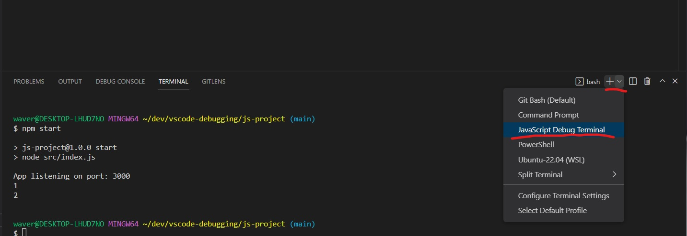
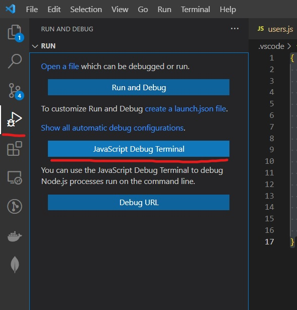
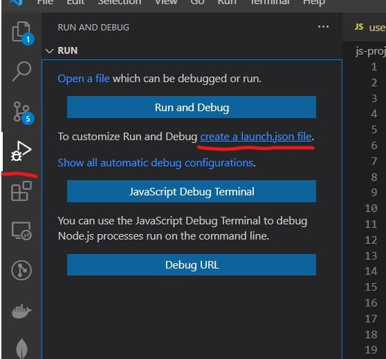
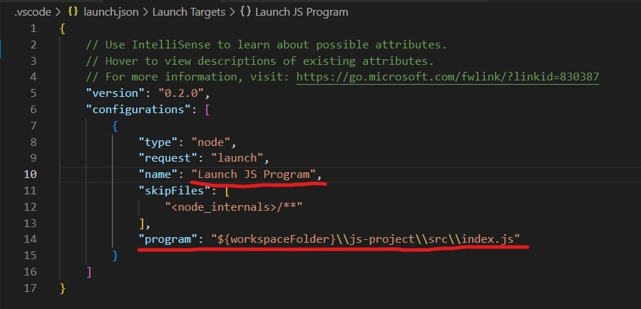
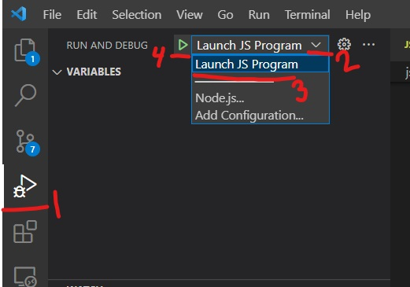

# Overview

There are two ways to debug this project: 
- JavaScript debugging terminal
- launch.json configuration file

# JavaScript debugging terminal

There are two ways to open the JavaScript debugging terminal:

**Option 1:** In the terminal, click the dropdown next to the plus icon and select "JavaScript Debug Terminal"



**Option 2:** Click the "Run & Debug" icon on the sidebar, then click "JavaScript Debug Terminal"



# launch.json configuration file

You can manually create the launch.json file, or have VSCode generate it for you.

## Generate launch.json file

Open the entry point file from the file explorer. Often this will be the index.js file, but that may vary based on the project. Then click the "Run & Debug" icon on the sidebar, then click "create a launch.json file" and then choose "node" in the dropdown.



## Update launch.json file for your configuration

This will create a `.vscode` folder containing a `launch.json` file in the root of your directory. That launch.json file will contain an array of configurations. Initially there will be one configuration object with a few properties. Update the "name" to be relevant for your project (optional). The "program" property will point from the workspace root, to the file that was open when you clicked "create a launch.json file" button. This should be your entry file, if it is not your entry file, then you can update this property.



## Run a configuration

Once the launch.json file is created, the configurations will appear in a dropdown at the top of the "Run & Debug" tab. You can select an option then click the play button to run the configuration in debug mode.



# Example .vscode/launch.json file
```json
{
    // Use IntelliSense to learn about possible attributes.
    // Hover to view descriptions of existing attributes.
    // For more information, visit: https://go.microsoft.com/fwlink/?linkid=830387
    "version": "0.2.0",
    "configurations": [
        {
            "type": "node",
            "request": "launch",
            "name": "Launch JS Program",
            "skipFiles": [
                "<node_internals>/**"
            ],
            "program": "${workspaceFolder}\\js-project\\src\\index.js"
        }
    ]
}
```
